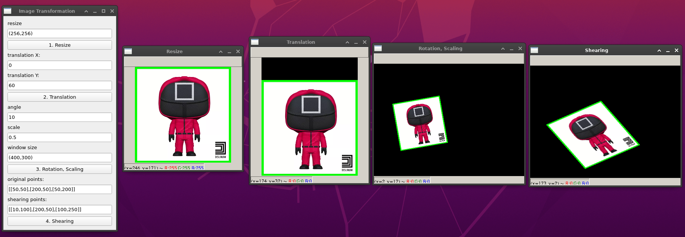

# image-transformation-opencv

A simple pyQt GUI application for image transformation.

To execute: run `python main.py`.

## Reference

[Geometric Transformations of Images](https://docs.opencv.org/3.4.12/da/d6e/tutorial_py_geometric_transformations.html)